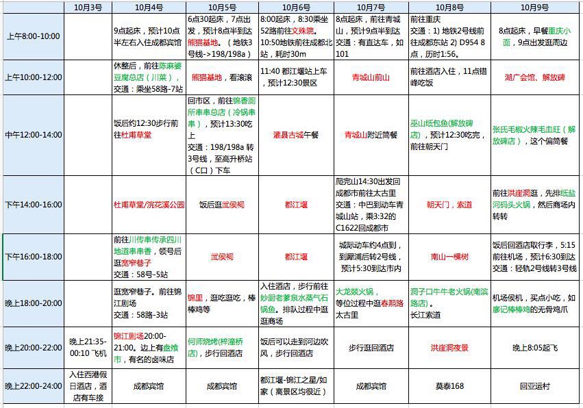

十一旅游规划
------------
### 具体行程安排

[部分门票及交通优惠方式](travel_cost.md)

### 参考资料
[蚂蜂窝成都](蚂蜂窝成都.pdf)

[蚂蜂窝重庆](蚂蜂窝重庆.pdf)

[蚂蜂窝都江堰](蚂蜂窝都江堰.pdf)

[蚂蜂窝青城山](蚂蜂窝青城山.pdf)

### 历史信息

[方案1](方案1.md)

*说明：都江堰&青城山+熊猫基地+成都市区（共计3天+一个上午）； 洪崖洞+湖广会馆+瓷器口+四川美院+轻轨+长江索道+朝天门+南山一棵树（共计2个半天+1个全天，可赏两个夜景）*

[方案2](方案2.md)

*说明：都江堰+青城山+熊猫基地+杜甫草堂+武侯祠+文殊院+春熙路+宽窄巷子（共计4天）； 洪崖洞+瓷器口+轻轨+长江索道+朝天门+南山一棵树（共计2个半天）*

[方案3](方案3.md)

*说明：都江堰+青城山+熊猫基地+杜甫草堂+武侯祠+文殊院+春熙路+宽窄巷子（共计4天，区别方案2的是在方案中6、7号都江堰+青城山）； 洪崖洞+瓷器口+轻轨+长江索道+朝天门+南山一棵树（共计2个半天）*
