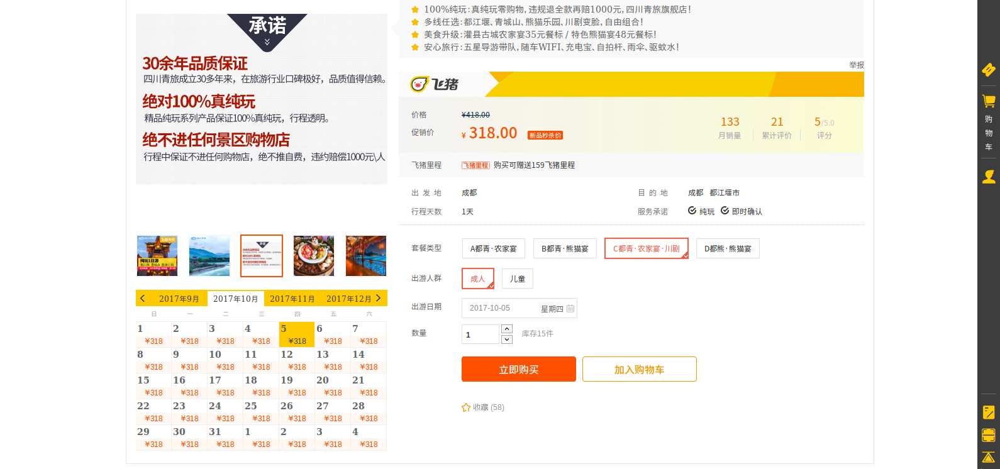
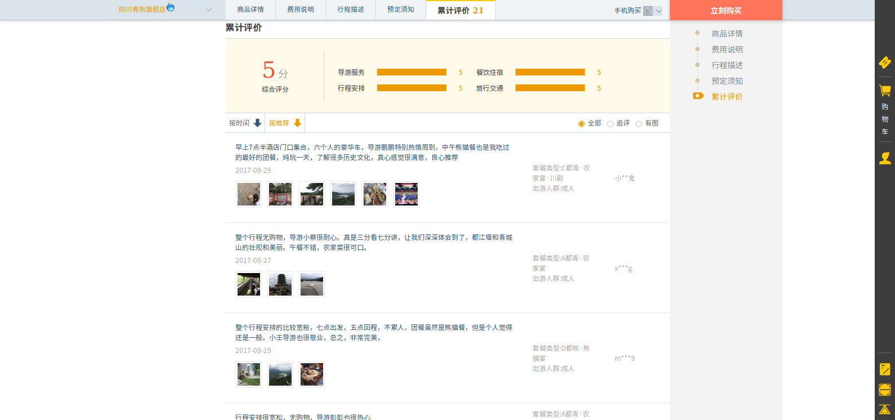
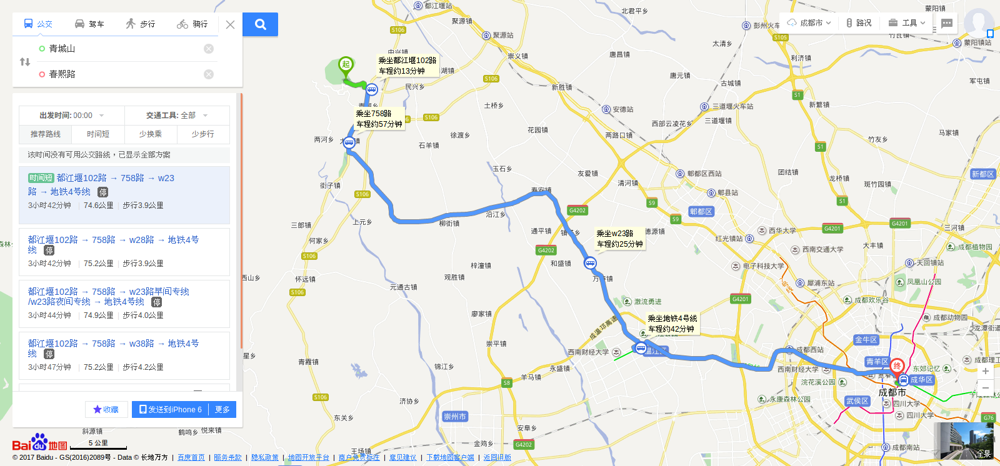

# 成都+重庆6天自由行
> 时间10.4~10.9日

成都
-------------
## 10月4日
### 杜甫草堂+成都大熊猫繁育研究基地+武侯祠（可选）+锦里
> 出行方式：自由行
>> 原因：这天的行程安排较为宽松，时间基本都可调整。主要的目的地是大熊猫繁育研究基地，但以大熊猫繁育基地的规模，大约一个下午左右的时间可以游览完毕。因此在上午安排了一个距离市中心不太远的文化景点作为中转。距离市中心较近的文化景点有杜甫草堂和武侯祠，上午可以在两者中间任选，其中杜甫草堂以景胜出，武侯祠以三国文化为情怀胜出。个人推荐杜甫草堂。锦里主要是小吃和美食闻名，但白天小吃会相对较少，晚上回到锦里（如果回的较早，可以去边上的武侯祠逛下）后，可以尝尝成都的小吃，且锦里距离市中心不远，正好便于我们在晚饭后逛回酒店。

**具体行程安排**

+ 10:00: 达到杜甫草堂
> 门票约60元，优惠价54元，游览时间约2小时
+ 12:00: 在杜甫草堂附近午餐
> 杜甫草堂有[直通车](#直通车微信订票二维码)去熊猫基地，建议在杜甫草堂附近午餐
+ 14:00: 到达成都大熊猫繁育研究基地
>  杜甫草堂-熊猫基地[直通车](#直通车微信订票二维码)10点起发车，基本15-30分钟一班，往返+熊猫基地+讲解的门票一共81元（没找到单程，单程或便宜），可微信订票。熊猫基地大约游览时间为2-4个小时左右，如果返回时间早的话，可以去武侯祠逛逛，否则直接去锦里
+ 18:00: 到达锦里
> 熊猫基地-锦里，[直通车](#直通车微信订票二维码)票价8元。锦里是一条仿古商业街，成都人气最旺景点之一。在这里，你可以欣赏捏泥人、摆糖画的手艺，也可以逛逛极富三国特色的店铺。街里还有各种四川特色小吃，各种茶楼、咖啡馆、酒吧、客栈等随时可落座。黄昏时分，锦里会亮起灯，颇有韵味，适合拍照游玩。 

##### 直通车微信订票二维码

## 10月5日
### 都江堰+青城山
> 出行方式： 推荐跟散团出游。
>> 原因： 这两个景点以文化和景为主，如果单游一个地点感觉行程会有些干涩，但到市区的往返班车又是固定的，自由行有些不便（参考下图百度给出的路线时间消耗，如果是坐动车到都江堰市的话，要小心当地的黑导游，另外都江堰景区最好需要导游解说，或者需要做足功课）。这条线路离我们所住的市中心有74.6公里的距离，另外一种比较简便的是在宽窄巷子做直通车到都江堰+青城山（*总计268元*，含门票），但中间需要倒车到宽窄巷子，并且只有早上8:30去，下午17:00点回的一趟班次。选择旅行团的一日游的优势是在都江堰景区会有导游解说，另外*包午餐、门票和车钱，加晚上可以看川剧变脸，总计318元*。可以在淘宝选择评价好的团进行出游，个人经验并没有被坑的经历，还是可以信赖的。

**具体行程安排**

+ 6:30: 市区二环内接客上车
+ 8:30: 到达都江堰景区
> 都江堰景区约3小时：经灌县古城（自费代步车10元/人）经离堆公园、伏龙观、张松银杏、卧铁、堰功道、清溪园。后游览都江堰水利工程宝瓶口引水口、飞沙堰泄洪坝、鱼嘴分水堤(自费代步车10元/人)过安澜索桥，前往李冰父子的二王庙，登上都江堰地标—玉垒阁，乘全国户外第二、长达128米的“天梯”步云廊扶梯(自费上下扶梯40元/人) 登顶玉垒阁} 
+ 12:30: 农家宴
> 30元标准，可能会比较将就
+ 14:00: 到达青城山
> 青城山景区约3小时：中国著名的道教名山，道教发源地之一，素有"青城天下幽"的美誉（自费观光车20元/人）可选择半山和登顶线路，登顶线路会产生（自费索道60元/人、月城湖游船10元/人），之后原路返回停车场上车返程
+ 19:00: 到达市区并自由选择晚餐
+ 20:00: 前往【蜀风雅韵】观看川剧变脸秀
> 活动约60分钟

##### [淘宝：飞猪旅行](https://traveldetail.fliggy.com/item.htm?spm=a230r.1.14.86.76bf523byLX0H&id=538198685552&ns=1&abbucket=10&smToken=e1fdd77a56fa43c58c16e52e4f7a672b&smSign=BL9ZOxDmTRpm4UDo%2BZcqgQ%3D%3D)
> 飞猪旅游还有不少红包奖励，应该还能便宜几十块钱

##### 百度显示的自由行路线和时间消耗

## 10月6日
### 文殊院+宽窄巷子+春熙路
> 逛吃逛吃逛吃
>> 原因：个人认为成都的行程主要分布在成都的周围，像九寨沟、都江堰+青城山、乐山+峨嵋、西岭雪山，这些基本都需要一天及以上的时间游玩，而我们的时间不足以支撑这些大景点的游玩，因此我主要挑了都江堰+青城山这条路线。这样我们有有5日晚上的锦里加上6日白天的时间可以单逛成都市，预留7、8、9约两天半的时间充分的逛一下重庆。
+ 10:00: 文殊院
> 文殊院本身是一个景点，重要的是文殊院附近有很多不错的美食！加上吃饭约2-3小时的时间

> 推荐的美食：老铁火锅、洞子口张二凉粉、双流老妈兔头
+ 14:00: 宽窄巷子
> 类似南锣鼓巷的存在，商业街，步行逛逛约2个小时，同时可以找些小吃，这边的熊猫邮局据说有些特色，可以邮寄明信片

> 推荐美食： 梁记肥肠粉

+ 16:00: 回春熙路
> 方便退宿考虑，回到春熙路，这一带是吃食最多的地方，春熙路本身也是商业街，可以在这边逛逛街，并试试这边的美食。同时准备去重庆！

> 推荐美食：龙抄手、夺命小串、降龙爪爪、鸡蛋仔、赖汤圆、夫妻肺片、肥肠粉……
+ 19:00: 回酒店准备出发去高铁站

重庆
> 重庆最厉害的是那儿的夜景、沿山而建的建筑群以及好吃的火锅
-------------
## 10月7日
### 洪崖洞
> 下午接近晚上到达重庆，从成都到重庆北约2个小时（成都当地时间最好选择下午2-3点左右出发）。选择下午时间达到重庆，可以有时间观赏下重庆的夜景。

**具体行程安排**

+ 18:00: 洪崖洞
> 交通方式：我们先到达解放碑处的旅店，放下行李后步行可到达洪崖洞

> 开放时间：20:00亮灯，22:00关灯。估计游览时间4小时。洪崖洞是逛山城老街、观赏两江风光、品尝当地美食的好去处。由纸盐河酒吧街、天成巷巴渝风情街、盛宴美食街及异域风情城市阳台四部分组成。以最具巴渝传统建筑特色的吊脚楼为主体，依山就势，夜晚时候灯火通明，堪称山城一景。从最底到顶层共有11层，隔层功能不同，顶层是异域风情城市阳台，可乘坐电梯直达。晚上去洪崖洞看夜景，灯光开启的时候，非常漂亮。 

## 10月8日
### 湖广会馆+朝天门+南山一棵树+长江索道
> 出行方式：以公交和地铁为主，这一天主要是围绕解放碑一线以东方向

**具体行程安排**

+ 10:00: 湖广会馆
> 交通方式：坐地铁1号线到小什字站下车，8号出口，直走右转，就在江边，黄颜色的建筑

> 游览时间约2小时。看点：湖广会馆是个清代建筑，会馆古色古香，绿化很好。建筑雕刻精美复古。参观结束后可选择在附近或是去朝天门午餐。

+ 14:00: 朝天门
> 看点：长江和嘉陵江的交汇处。

> 游览时间约1-2小时。朝天门广场最近正在施工，不确定十一国庆的时候是否完工。另外，朝天门可以选择游船的方式欣赏，可网上订票，约50分钟行程。

+ 16:00: 南山一棵树
> 交通方式：上新街乘定线车到南山一棵树

> 开放时间：9:00-22:30。建议在这边看夕阳和夜景（重庆的日落时间18:39），观景完毕后，到附近的泉水鸡一条街吃饭

+ 20:00: 长江索道
> 从上新街索道到新华路索道这一方向的人会相对较少一些。开放时间：7:00~22:00

## 10月9日
### 瓷器口古镇+四川美院
> 出行方式：以轻轨为主，一来体验重庆独特的轻轨特色，二来体验下重庆有名的瓷器口古镇和四川美院的文艺范儿（都是适合拍照的地儿）

**具体行程安排**

+ 9:00: 瓷器口古镇
> 交通方式：解放碑乘坐轻轨1号线瓷器口站下车即是。

> 游览时间约2小时。午餐时间1-2小时，总计约3-4小时。

+ 13:00: 四川美院黄角坪校区
> 交通方式：轻轨1号线倒轻轨2号线在杨家坪下车，转223、233、256、277、823 路公交车在黄桷坪站或四川美院站下车，或在杨家坪打的过去，起步价就能到

> 游览时间：约1-2小时。最有名的是学校外面的涂鸦街，一整条街的建筑满墙都是各种涂鸦，涂鸦略显旧了但还是挺美挺壮观的。周围的小吃比较多，梯坎豆花、胡记蹄花汤都在这里，价格便宜，学生消费，值得一试。 

+ 16:00: 回到解放碑酒店
> 交通方式：轻轨

> 准备回北京！
